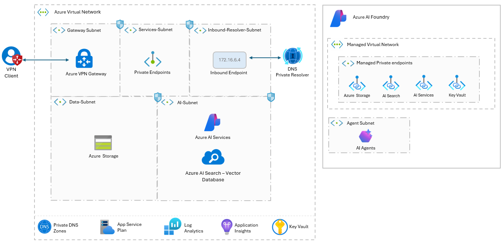

# AI Foundry Project Landing Zone - Network Secure

> ⚠️ **Active Development**  
> This project is under active development and may contain breaking changes. Stability will improve as we approach a stable release.

## Overview
This repository implements the **Azure AI Baseline Reference Architecture** to deploy an **AI Foundry Landing Zone**. It aligns with best practices for networking, security, and model hosting.

The solution automates:
- AI Foundry Projects
- Managed VNet and private endpoints
- Compute clusters for model hosting
- Observability with Log Analytics and Application Insights

## 🔗 Reference Materials

 **Azure AI Foundry Reference Architecture**  
This project builds on the Azure AI Baseline Reference Architecture to help you design and deploy enterprise-grade generative AI solutions. It incorporates networking, security, and authorization best practices, enabling a scalable and secure AI environment.  

🔗 [Azure AI Baseline Reference Architecture](https://learn.microsoft.com/en-us/azure/architecture/ai-ml/architecture/baseline-openai-e2e-chat)  

🔗 [Azure AI Foundry Agents Network-Secured Environment](https://learn.microsoft.com/en-us/azure/ai-foundry/agents/how-to/virtual-networks)  

🔗 [Private storage configuration](https://learn.microsoft.com/en-us/azure/ai-foundry/how-to/configure-private-link?tabs=azure-portal&pivots=hub-project#private-storage-configuration)  

Please review the **quickstart** templates that demonstrates how to set up Azure AI Foundry with a network-restricted configuration.

🔗 [Azure AI Foundry Template - Network Restricted ](https://github.com/Azure/azure-quickstart-templates/tree/master/quickstarts/microsoft.machinelearningservices/aifoundry-network-restricted)  

🔗 [Azure AI Foundry Agents Template - Network Restricted ](https://github.com/Azure/azure-quickstart-templates/tree/master/quickstarts/microsoft.azure-ai-agent-service/network-secured-agent)  

**AI Model Deployment in Azure AI Foundry**  
To explore model deployment options, including serverless models, fine-tuning, and inference endpoints, refer to the official documentation.  

🔗 [Deploy AI Models in Azure AI Foundry Portal](https://learn.microsoft.com/en-us/azure/ai-foundry/concepts/deployments-overview)  

🔗 [Deploy models as serverless APIs](https://learn.microsoft.com/en-us/azure/ai-foundry/how-to/deploy-models-serverless)  

---

## 🛠️ **Core Steps for Solution Implementation**

Follow these key steps to successfully deploy Azure AI Foundry:

### 1️⃣ [**Deploy the Solution**](docs/deployment.md)
- Detailed instructions for deploying Azure AI Foundry, including prerequisites, configuration steps, and setup validation.   

---

## ♻️ Clean-Up

After completing testing, ensure to delete any unused Azure resources or remove the entire Resource Group to avoid incurring additional charges.

## 📜 License
This project is licensed under the [MIT License](LICENSE.md), granting permission for commercial and non-commercial use with proper attribution.

## Disclaimer
This demo application is intended solely for educational and demonstration purposes. It is provided "as-is" without any warranties, and users assume all responsibility for its use.
